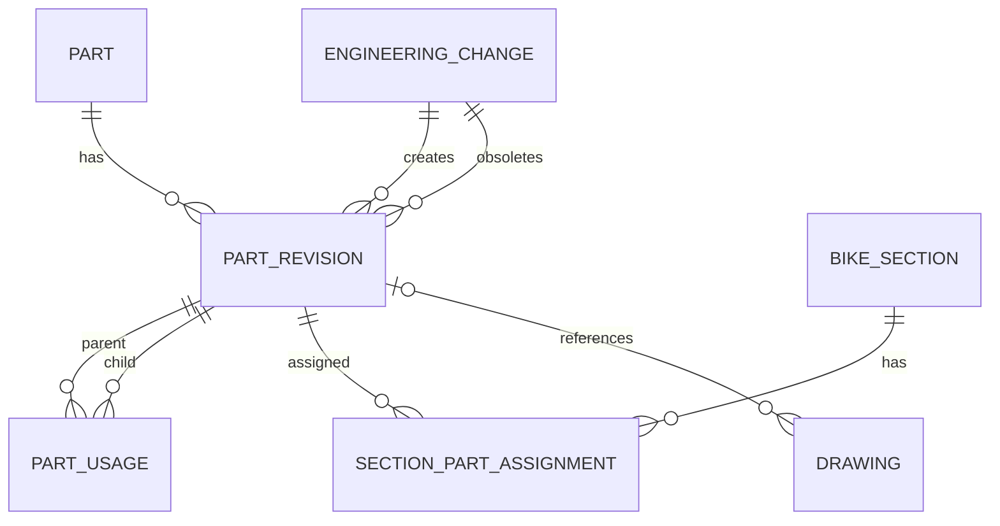

# 教育用ケーススタディ: バイク製造管理/BOM のDB設計（概念設計からER図まで）

- date: 2026-04-14
- domain: architecture
- language: sql
- status: active
- reliability: partially-verified
- review_due: 2026-05-14

## 1. この資料の使い方（人間向け）
この資料は「仕様が完璧に固まっていない状態」で、どうやってDB設計を進めるかを学ぶための教材。

- 目的: 設計思考の順序を再利用可能にする。
- 到達点: 概念モデルと教育用ER図（Mermaid）を作れる。
- 非目的: いきなり物理DDLを最適化しきること。

## 2. 与件（今回の前提）
- バイク製造管理システム。
- 部品表（BOM）管理。
- 部品は複数子部品を持つ（多階層）。
- ある部品は別の部品に使われる（再利用）。
- バイクの大粒度部位（タンク等）に部品を割り当てる。
- 部品には番号と名称がある。
- 設計変更で新しい部品番号（部分変更）を発番して追加。
- 変更前部品を利用している親は追従が必要。
- 1台に約3000点の部品。
- 図面あり/なし部品がある。
- 一般部品は寸法ベースの番号で図面なし。

## 3. まず最初に考えること（設計の北極星）

### 3.1 失敗定義（これを防ぐ）
1. 誤った部品が製造指示に乗る。
2. 設計変更が親BOMに反映されず旧版が残る。
3. 過去ロットで何が使われたか追跡できない。

### 3.2 成功定義（最低限達成）
1. 変更前後の部品関係を時点付きで追える。
2. 1台3000点規模でもBOM展開が実用速度で可能。
3. 図面なし一般部品も同じモデル内で矛盾なく扱える。

## 4. 思考の順序（教育用の実践フロー）

### Step 1. 用語固定（ユビキタス言語）
- 作業: Part, PartRevision, BOM, ECO, Drawing, GeneralPart を定義。
- なぜ先にやるか: ここが曖昧だと全設計がブレる。
- 出力: 用語集。

### Step 2. イベント時系列を書く
- 作業: 作成→承認→採用→変更→置換→廃止。
- なぜ先にやるか: ERは静的、業務は動的。先に動きを理解する。
- 出力: イベント一覧。

### Step 3. 境界づけ（Bounded Context）
- 候補:
  - Part Master（部品/改版）
  - BOM（親子構成）
  - Engineering Change（変更指示）
  - Drawing（図面管理）
- ルール: 境界内は強整合、境界間はイベント連携。
- 出力: Context Map。

### Step 4. 集約の定義
- 例:
  - PartRevision集約: 部品版の状態・属性
  - BOMLine集約: 親版に対する子版の採用情報
- ルール: 1トランザクションで守る不変条件を限定。
- 出力: Aggregate一覧。

### Step 5. 識別子戦略
- 方針:
  - 内部ID: 不変（surrogate key）
  - 部品番号: 業務都合で変更可能
- なぜ重要か: 番号変更時に参照関係を壊さないため。
- 出力: ID方針書。

### Step 6. 改版ルール定義
- ルール候補:
  - 変更は新revision追加（旧revisionは履歴保持）
  - 旧版→新版置換の有効開始日を持つ
  - 親BOM追従方式（自動/承認付き手動）を明示
- 出力: 改版規約。

### Step 7. BOM構造制約
- ルール候補:
  - 多階層可
  - 循環参照禁止
  - 同一親で同一子の重複禁止（条件付き）
- 出力: BOM制約一覧。

### Step 8. 状態遷移設計
- 例: Draft -> Released -> Obsolete
- 注意: 現在状態テーブルと遷移履歴テーブルを分離。
- 出力: 状態遷移図。

### Step 9. 概念ERの作成
- 目的: 人間同士の合意形成。
- 出力: エンティティと関係（キー未確定でも可）。

### Step 10. 論理ERへ落とし込む
- 作業: PK/FK/UNIQUE/CHECK、有効期間、監査列を追加。
- 出力: 論理ER + 制約表。

### Step 11. シナリオ試験
- 必須シナリオ:
  1. 設計変更で新版を発番
  2. 旧版使用中の親に追従案を提示
  3. 図面なし一般部品の登録
- 出力: シナリオ検証表。

### Step 12. 物理化の判断
- 作業: インデックス、展開性能、履歴保持コストを試算。
- 出力: 物理ER/DDL草案。

## 5. 成果物マップ（思考と出来上がるもの）

| フェーズ | 主な問い | 成果物 | 典型レビュー観点 |
|---|---|---|---|
| 問題定義 | 何が失敗か | 失敗定義メモ | 漏れはないか |
| 用語定義 | 同じ言葉で話せるか | 用語集 | 用語衝突はないか |
| 振る舞い定義 | 何が起きるか | イベント一覧 | 例外は考慮済みか |
| 境界設計 | どこを強整合にするか | Context Map | 依存が過密でないか |
| 概念設計 | 何が何に関係するか | 概念ER | 関係の方向は妥当か |
| 論理設計 | 何で守るか | 論理ER/制約表 | 制約不足/過剰はないか |
| 検証 | 実運用で壊れないか | シナリオ検証表 | 追従運用できるか |
| 物理設計 | SLAを満たせるか | 物理ER/DDL | 性能・保守性の均衡 |

## 6. 推定概念モデル（現状仕様から）

- Part（部品概念）
- PartRevision（版）
- PartUsage（BOM行: 親版-子版の使用）
- BikeSection（タンク等の大分類）
- SectionPartAssignment（部位への割付）
- Drawing（図面情報、任意）
- EngineeringChange（変更指示/ECO）

## 7. 教育用 概念ER（Mermaid）

## 8. 仕様未確定のまま先に決める質問
1. 番号変更は同一PartのRevision増加で統一するか。
2. 親BOM追従は自動か、承認付きか。
3. 追従適用時点は即時か、次ロットか。
4. 一般部品番号は寸法文字列を正規化するか。
5. 図面なし部品の品質根拠を何で持つか。
6. 循環参照を禁止するか、例外を設けるか。
7. BOM展開性能目標（例: 3000点を何秒以内）をいくつにするか。
8. 廃止部品の過去参照を許可するか。

## 9. 教育向けの講義ポイント（原則との対応）
- 内部ID不変・業務番号可変: 改版時の追従容易性。
- 現在値と履歴の分離: 監査・トレーサビリティ。
- 境界内強整合: BOM崩壊防止。
- 非正規化は計測後: 早すぎる最適化回避。
- シナリオ検証先行: 仕様未確定でも前進できる。

## 10. 変更履歴
- 2026-04-14: 初版
- 2026-04-14: 既存ノートから教育用ケーススタディを分離し、人間向けに詳細化
